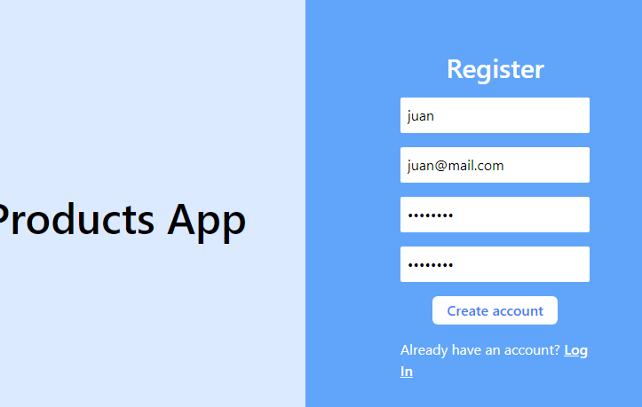
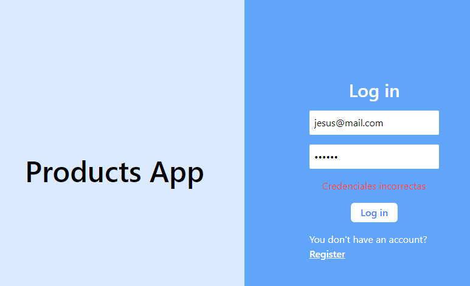
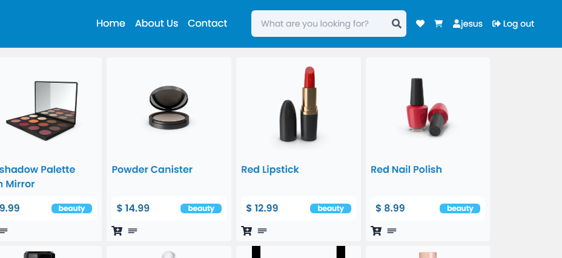

# Clase30: Session 

1 Login & Register.
2 Persist of session.
3 Using localstorage to save accesstoken.
4 using redux to save user logged date 

Resumen de Funcionalidades
Registro de Usuario:

1 Se implementó un formulario de registro que permite a los nuevos usuarios crear una cuenta.
El formulario recoge datos como el correo electrónico y la contraseña.
Se realiza una validación básica para asegurar que todos los campos requeridos estén completos antes de enviar la solicitud al servidor.

2 Inicio de Sesión:

Un formulario de inicio de sesión fue añadido para permitir a los usuarios existentes acceder a sus cuentas.
Al enviar las credenciales (correo electrónico y contraseña), se realiza una solicitud a la API para autenticar al usuario.
Si la autenticación es exitosa, el usuario es redirigido a la página de inicio (/home), y se almacenan los datos del usuario en el estado global mediante Redux.

3 Navbar
Se implementó un Navbar que muestra el nombre del usuario actualmente logueado, proporcionando una experiencia personalizada.
Si el usuario ha iniciado sesión, se despliega un botón de Logout que permite al usuario cerrar su sesión. Al hacer clic en este botón:
Se eliminan los datos del usuario del estado global y del almacenamiento local.
Se redirige al usuario a la página de inicio de sesión (/login).
Si no hay un usuario logueado, el Navbar no muestra opciones de acceso, asegurando que solo los usuarios autenticados puedan ver ciertas funciones.

